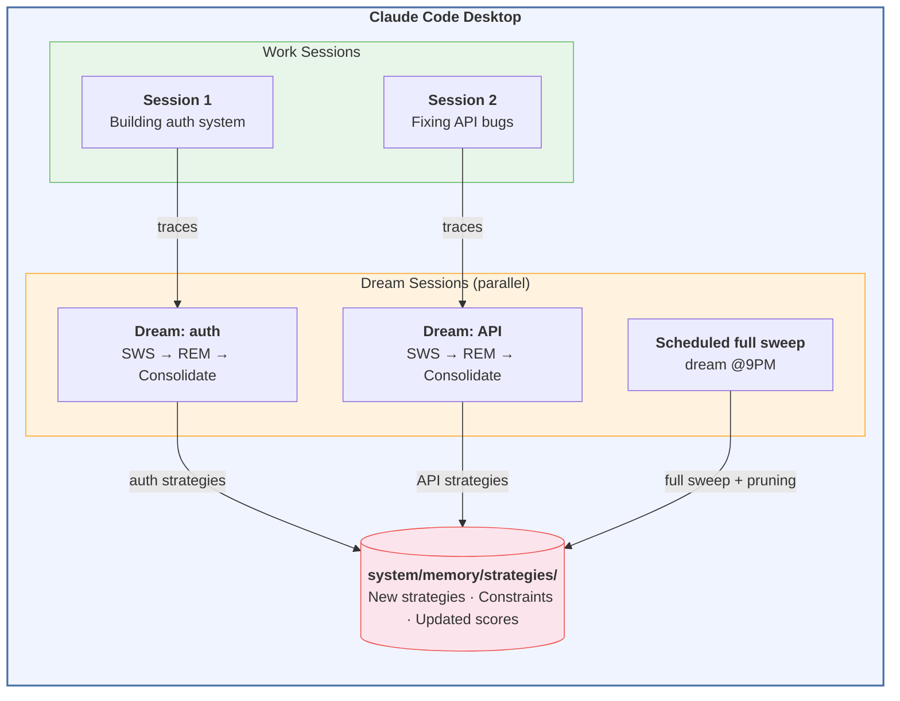
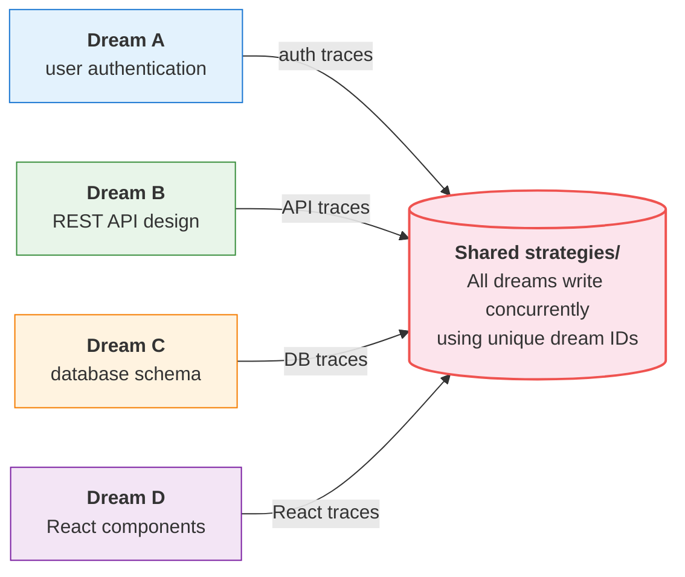
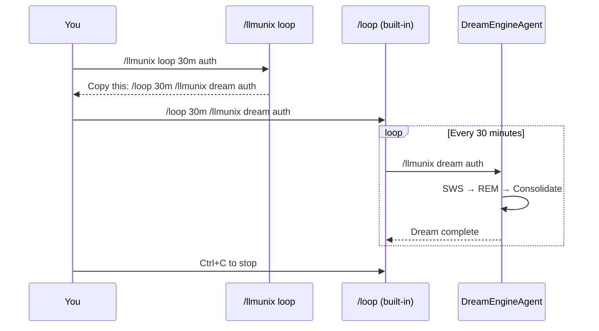

# LLMunix DreamOS

**A Bio-Inspired Cognitive Operating System for Claude Code Desktop**

> *"What if your AI assistant remembered what worked, learned from what failed, and got smarter every time you used it?"*

DreamOS transforms Claude from a **stateless assistant that forgets everything between sessions** into a **learning system** that accumulates strategies, avoids past mistakes, and improves with every interaction. It brings the algorithmic rigor of hierarchical memory consolidation — proven in physical robotics — to the Claude Code Desktop plugin ecosystem.

DreamOS uses **unihemispheric dreaming** — inspired by dolphins, which sleep with one brain hemisphere while the other stays alert. Instead of waiting for a nightly consolidation cycle, DreamOS can dream *while you work*: parallel dream sessions consolidate traces in the background, focused on specific goals or broad sweeps, on-demand or on a schedule.

---

## Table of Contents

- [The Problem](#the-problem)
- [The Solution](#the-solution-dreamos)
- [What DreamOS Adds to Claude Code Desktop](#what-dreamos-adds-to-claude-code-desktop)
- [Architecture Overview](#architecture-overview)
- [Installation](#installation)
- [Unihemispheric Dreaming](#unihemispheric-dreaming)
  - [Loop Mode — Recurring Dreams with `/loop`](#loop-mode--recurring-dreams-with-loop)
- [Tutorial: Using DreamOS](#tutorial-using-dreamos)
- [Directory Structure](#directory-structure)
- [How the Dream Engine Works](#how-the-dream-engine-works)
- [Seed Strategies](#seed-strategies)
- [Strategy Format Reference](#strategy-format-reference)
- [Provenance](#provenance)
- [License](#license)

---

## The Problem

AI coding assistants today suffer from **cognitive amnesia**. Every time you start a new session with Claude, the slate is wiped clean:

**1. No memory of what worked.** You solved a tricky React hydration bug last week using a specific pattern. Today, facing the same issue, Claude starts from scratch — suggesting the same wrong approaches you already tried and rejected.

**2. No memory of what failed.** Last month, Claude tried to `npm install --force` and broke your lock file. Today, facing a similar dependency conflict, it suggests the exact same destructive approach.

**3. No accumulation of expertise.** You've been building Express APIs for months. Claude has helped you create 15 endpoints. But it still doesn't "know" your project's patterns — it doesn't remember that you always use Zod for validation, that your error handler expects a specific format, or that your team uses a particular middleware ordering.

**4. No strategic planning.** Claude treats every task as if it's the first one. It doesn't decompose complex goals into hierarchical sub-tasks, doesn't track which sub-tasks depend on others, and doesn't learn from the outcomes of multi-step plans.

**5. Repeated mistakes across sessions.** Without persistent memory, the same anti-patterns reappear. The same debugging rabbit holes get explored. The same time gets wasted.

This problem exists because **Claude is stateless by design**. Its built-in memory (`CLAUDE.md`, auto-memory) captures basic preferences but lacks the structure to store *strategies*, *anti-patterns*, *confidence scores*, or *hierarchical task decompositions*. There is no mechanism to analyze past sessions, extract what worked, discard what didn't, and synthesize reusable knowledge.

### The Cost of Forgetting

| Scenario | Without DreamOS | With DreamOS |
|----------|----------------|--------------|
| Setting up a new Express API | Claude guesses your conventions every time | Claude applies `strat_3_api-endpoint` with your team's patterns |
| Hitting an npm ERESOLVE error | Claude suggests `--force` (again) | `_negative_constraints.md` blocks the destructive approach; `seed_3_npm-troubleshooting` provides the proven fix |
| Debugging a failing test | Claude tries random changes | `seed_4_debug-strategy` enforces systematic isolation |
| Second week on a project | Same quality as day one | Strategies evolved from 10+ successful traces guide better plans |

---

## The Solution: DreamOS

DreamOS is a **Claude Code Desktop plugin** that implements a biologically-inspired cognitive architecture. It is based on three innovations, originally proven in [RoClaw](https://github.com/EvolvingAgentsLabs/RoClaw) — a physical robot that learns to navigate rooms by consolidating motor traces into reusable strategies during "sleep" phases.

### 1. Hierarchical Task Decomposition (L1-L4)

Every task is decomposed into a 4-level cognitive hierarchy, mirroring neocortical organization:

| Level | Name | Software Equivalent | Example |
|-------|------|---------------------|---------|
| **L1** | GOAL | Epic / Project | "Build authentication system" |
| **L2** | ARCHITECTURE | Strategy / Design | "Implement JWT with refresh tokens" |
| **L3** | TACTICAL | Module / Task | "Write middleware for token validation" |
| **L4** | REACTIVE | Command / Tool Call | `npm install jsonwebtoken` |

Traces at each level link to their parent, forming a tree that the Dream Engine can analyze for patterns.

### 2. Execution Traces (Short-Term Memory)

Every significant action is logged as a structured trace with: hierarchy level, parent linkage, goal, applied strategy, outcome (SUCCESS/FAILURE/PARTIAL), confidence score, and action details. These traces are the raw material for learning.

### 3. Unihemispheric Dream Engine (3-Phase Memory Consolidation)

Dolphins never fully sleep — one brain hemisphere consolidates memories while the other remains active. DreamOS works the same way. Dream sessions run **in parallel with active work**, triggered on-demand, by goal, or on a schedule. Each dream is focused: it can process all traces, or only traces matching specific goals or hierarchy levels.

Each dream session executes the same 3-phase cycle:

| Phase | Biological Analog | What It Does |
|-------|-------------------|-------------|
| **Phase 1: SWS** | Slow Wave Sleep | Replays failures. Extracts **negative constraints** — things to NEVER do again. |
| **Phase 2: REM** | REM Sleep | Abstracts successful patterns into **reusable strategies** with confidence scores. Merges new evidence into existing strategies. |
| **Phase 3: Consolidation** | Memory Writing | Writes strategies and constraints to disk. Updates the dream journal. Prunes old traces. |

Multiple dream sessions can run simultaneously — for example, one consolidating "authentication" traces while another consolidates "database" traces — all while you continue coding in another session.

---

## What DreamOS Adds to Claude Code Desktop

| Capability | Claude Code Desktop Alone | Claude Code Desktop + DreamOS |
|-----------|--------------------------|-------------------------------|
| **Memory** | `CLAUDE.md` + auto-memory (preferences only) | Hierarchical strategies with confidence scores, negative constraints, dream journal |
| **Learning** | None between sessions | Dream Engine extracts strategies from successes and constraints from failures |
| **Unihemispheric Dreaming** | Not possible | Dream sessions run in parallel with work — on-demand, goal-focused, scheduled, or all three at once |
| **Planning** | Ad-hoc, flat task decomposition | 4-level hierarchical decomposition (L1-L4) with strategy injection |
| **Error prevention** | None | Negative constraints loaded before every task; high-severity constraints always enforced |
| **Task logging** | No structured logging | Hierarchical traces with parent-child linking, outcomes, and confidence |
| **Knowledge reuse** | Manual copy-paste | Automatic strategy matching via trigger keywords and composite scoring |
| **Parallel sessions** | Independent worktrees | Work sessions + dream sessions run simultaneously; each dream can focus on specific goals |

### Concrete Example: What Changes

**Without DreamOS** — You ask Claude to "add user registration endpoint":
1. Claude improvises a plan from scratch
2. May or may not follow your project conventions
3. If it fails, the failure is forgotten
4. Next time, it starts over

**With DreamOS** — Same request:
1. Claude checks `_negative_constraints.md` — avoids known anti-patterns
2. Claude searches strategies — finds `seed_3_api-endpoint` (REST API creation)
3. Claude follows the strategy steps, adapted to your project
4. Actions are logged as L3 traces with parent linking
5. After completion, a goal-focused dream session consolidates the experience in parallel
6. Next time: higher-confidence strategy, even better execution

---

## Architecture Overview

DreamOS adapts the `llmunix-core` Dream Engine from RoClaw (a physical robot) to software development:

| RoClaw (Robotics) | DreamOS (Software) |
|---|---|
| Execution traces (bytecodes) | Session logs (tool calls, bash, file ops) |
| Motor hierarchy (L1 Goal → L4 Motor) | Task hierarchy (L1 Epic → L4 Command) |
| Negative constraints (collision warnings) | Anti-patterns (don't overwrite files, don't skip tests) |
| Bytecode (6-byte binary) | Claude Code tool calls |
| Semantic Map (topological room graph) | Codebase map (file dependencies) |
| Strategy (doorway approach pattern) | Strategy (TDD workflow, API creation pattern) |
| Cortex (goal planner) | SystemAgent |
| Cerebellum (motor control) | Executing sub-agents |
| Hippocampus (memory consolidation) | DreamEngineAgent |
| Circadian sleep cycle | **Replaced**: Unihemispheric (dolphin) dreaming — parallel, continuous, goal-focused |

### Three Core Agents

| Agent | Biological Role | Function |
|-------|----------------|----------|
| **SystemAgent** | Cortex | Executive orchestrator — decomposes goals, queries strategies, delegates to specialized agents |
| **MemoryAnalysisAgent** | Hippocampal Encoder | Real-time trace logger — captures execution events as structured hierarchical traces |
| **DreamEngineAgent** | Hippocampus | Memory consolidator — runs the 3-phase SWS/REM/Consolidation cycle. Supports parallel, goal-focused dreaming. |

### Unihemispheric Dream Architecture

Unlike traditional circadian models (dream once at night), DreamOS uses **dolphin-inspired unihemispheric sleep**: dreaming happens continuously alongside active work.



Dream sessions can be triggered four ways:
- **On-demand**: `/llmunix dream authentication` — dream about specific traces right now
- **After task completion**: The `/llmunix` command auto-triggers per-agent dream cycles (minimum 3)
- **Loop mode**: `/llmunix loop` generates a `/loop` command for session-scoped recurring dreams
- **Scheduled**: A recurring Desktop task runs a full-sweep or goal-focused dream on a timer

---

## Installation

### Prerequisites

- **Claude Pro, Max, Team, or Enterprise** subscription
- **Claude Desktop** app: Download from [claude.com/download](https://claude.com/download) (macOS or Windows)

### Step 1: Install the Plugin

Open **Claude Desktop** and switch to the **Code** tab. Then install the DreamOS plugin using one of these methods:

#### Method A: Install via the Plugin Manager (Recommended)

1. Click the **+** button next to the prompt box
2. Select **Plugins**
3. Select **Add plugin** to open the plugin browser
4. Search for `llmunix-dreamos` and install it

#### Method B: Ask Claude to Install It

In any Code session, simply ask:

```
Please install the llmunix-dreamos plugin from EvolvingAgentsLabs globally
```

Claude will run the necessary commands for you.

### Step 2: Open Your Project

1. Start a **new session** in the Code tab
2. Select your project folder — or create a new one
3. DreamOS activates automatically when the plugin is installed

The `system/memory/` directory will be created in your project folder on first use. This is where strategies, constraints, and traces are stored.

### Step 3: Set Up Dreaming

DreamOS dreams can be triggered on-demand, after tasks, or on a schedule. See the [Unihemispheric Dreaming](#unihemispheric-dreaming) section below for the full guide.

### Verify Installation

After installation, test that DreamOS is active by typing in any Code session:

```
What strategies do you have loaded? Check system/memory/strategies/_seeds/
```

Claude should read the seed strategies and report 6 bootstrap strategies.

You can also use the `/llmunix` command:

```
/llmunix List all available seed strategies
```

---

## Unihemispheric Dreaming

Dolphins sleep with one brain hemisphere at a time — they never fully stop. DreamOS works the same way: **dream sessions run in parallel with active work sessions**, consolidating traces into strategies without interrupting your flow.

There is no circadian constraint. Dreams don't wait for "night". They can happen anytime, in any combination:

| Trigger | How It Works | Best For |
|---------|-------------|----------|
| **On-demand** | `/llmunix dream [keywords]` | Consolidate after finishing a specific feature or fixing a class of bugs |
| **After task completion** | Automatic — `/llmunix` triggers per-agent dream cycles (min 3) | Every task contributes to learning immediately |
| **Loop mode** | `/llmunix loop` generates a `/loop` command for recurring dreams | Active coding sprints — lightweight, session-scoped |
| **Scheduled** | Recurring Desktop task (hourly, daily, etc.) | Full-sweep catch-all to consolidate anything the focused dreams missed |
| **Parallel multi-goal** | `/llmunix dream --parallel auth \| API \| database` | Dream about multiple domains simultaneously after a big sprint |

### On-Demand Dreaming

Trigger a dream anytime from any Code session:

```
/llmunix dream                              # Full sweep — process all unprocessed traces
/llmunix dream authentication               # Goal-focused — only auth-related traces
/llmunix dream L3                           # Level-focused — only tactical traces
/llmunix dream authentication L3            # Combined — auth tactical traces
/llmunix dream --parallel auth | API | db   # Parallel — three dream sessions at once
/llmunix dream status                       # Check memory state, unprocessed trace count
```

Each dream runs as its own session with a unique dream ID, so multiple dreams can safely run in parallel without conflicts.

#### Goal-Focused Dreams

Goal-focused dreams only process traces whose `goal` field matches your keywords (50%+ overlap). This is powerful because:

- **Fast**: Processes a subset of traces instead of everything
- **Targeted**: Produces strategies specific to the domain you just worked on
- **Parallel-safe**: Won't interfere with other dream sessions or active work
- **Immediate**: Results are available to your next session right away

Example: After building an authentication system across 3 sessions, run:

```
/llmunix dream authentication JWT middleware
```

This produces strategies specifically about auth patterns, ignoring unrelated traces from other work.

#### Parallel Multi-Goal Dreams

After a big sprint that touched multiple domains, launch parallel dream sessions:

```
/llmunix dream --parallel user authentication | REST API design | database schema | React components
```

This creates 4 separate dream sessions, each focused on one domain. They run concurrently in parallel Desktop sessions:



Each dream uses its own unique dream ID for concurrency safety.

### Loop Mode — Recurring Dreams with `/loop`

Claude Code has a built-in `/loop` command that runs any command on a recurring interval within your current session. DreamOS integrates with this via `/llmunix loop`, which generates the right `/loop` command for you to copy and run.

This is the **simplest way to set up recurring dreams** — no scheduled tasks to configure, no Desktop UI needed. Just paste and go.

#### Quick Start

```
/llmunix loop                          # Outputs: /loop 1h /llmunix dream
/llmunix loop authentication           # Outputs: /loop 1h /llmunix dream authentication
/llmunix loop 30m API endpoints        # Outputs: /loop 30m /llmunix dream API endpoints
/llmunix loop stop                     # Outputs instructions for stopping
```

The plugin outputs the command — you paste it into your session to start the loop. This is because `/loop` is a built-in CLI command that plugins cannot invoke directly.

#### How It Works



#### Loop Mode vs Scheduled Tasks

| Feature | Loop Mode (`/llmunix loop`) | Scheduled Tasks (Desktop UI) |
|---------|---------------------------|------------------------------|
| **Setup** | One command, paste and go | Configure in Desktop Schedule UI |
| **Scope** | Current session only (max 3 days) | Persistent across sessions |
| **Survives restart** | No — stops when session ends | Yes — runs on Desktop schedule |
| **Best for** | Active coding sprints, quick experiments | Long-running projects, team workflows |
| **Stop** | Ctrl+C or close session | Toggle in Schedule UI |

**Recommendation**: Use **Loop Mode** during active work sessions for lightweight recurring dreams. Use **Scheduled Tasks** for persistent, project-wide consolidation that survives restarts.

### Scheduled Dreams

For a safety net that catches any traces not processed by on-demand dreams, set up a recurring scheduled task.

#### How to Set Up

1. Open **Claude Desktop** and switch to the **Code** tab
2. Click **Schedule** in the sidebar
3. Click **+ New task**
4. Configure the task:

| Field | Value |
|-------|-------|
| **Name** | `dreamos-dream` |
| **Description** | DreamOS full-sweep memory consolidation |
| **Prompt** | See [Full-Sweep Dream Prompt](#full-sweep-dream-prompt) below |
| **Frequency** | **Hourly** (aggressive), **Daily** (standard), or **Weekdays** (work projects) |
| **Working folder** | Your project folder (the one containing `system/memory/`) |
| **Permission mode** | **Auto accept edits** (the Dream Engine only reads traces and writes strategy files) |
| **Worktree** | Off (the Dream Engine reads/writes to `system/memory/` which should be shared) |

5. Click **Run now** to test. Select "always allow" for any permission prompts to avoid future stalls.

#### Alternative: Ask Claude to Create It

```
Set up an hourly scheduled task called "dreamos-dream" that runs the DreamOS
full-sweep dream consolidation cycle on system/memory/traces/.
```

Or for goal-focused scheduled dreams:

```
Set up two daily scheduled tasks:
1. "dreamos-dream-api" at 12 PM — goal-focused dream for "API endpoint" traces
2. "dreamos-dream-sweep" at 9 PM — full-sweep dream to catch everything else
```

#### Full-Sweep Dream Prompt

Use this prompt for a scheduled full-sweep dream:

```
You are running the DreamOS Dream Engine full-sweep consolidation. Execute these steps:

1. Read system/memory/strategies/_dream_journal.md to find the last dream timestamp.

2. Read all trace files in system/memory/traces/ (files matching trace_*.md).
   Only process traces NEWER than the last dream timestamp.
   If no new traces, report "No new traces to process" and stop.

3. Phase 1 — Slow Wave Sleep (Failure Analysis):
   - Filter traces with outcome = FAILURE or PARTIAL with confidence < 0.3
   - For each failure: identify root cause, actions that led to failure
   - Extract negative constraints with severity ratings
   - Deduplicate against system/memory/strategies/_negative_constraints.md

4. Phase 2 — REM Sleep (Strategy Abstraction):
   - Filter traces with outcome = SUCCESS or high-confidence PARTIAL (>= 0.5)
   - Group by hierarchy level (L1-L4)
   - For each success: compress actions, search for matching strategies (50%+ overlap)
   - Match: merge evidence (version++, success_count++, confidence += 0.05, cap 0.95)
   - No match: create new strategy (confidence: 0.5)
   - Deprecation: if failure_count > success_count * 2 (min 3 attempts), mark deprecated

5. Phase 3 — Consolidation:
   - Write constraints to system/memory/strategies/_negative_constraints.md
   - Write strategies to level_1_epics through level_4_reactive directories
   - Append summary to system/memory/strategies/_dream_journal.md
   - Prune trace files older than 7 days (never delete today's)
   - NEVER modify files in system/memory/strategies/_seeds/

6. Report: strategies created, updated, constraints extracted, traces pruned.
```

#### Goal-Focused Scheduled Dream Prompt

For a scheduled task that dreams about a specific domain:

```
You are running a DreamOS goal-focused dream consolidation.
Goal filter: [YOUR KEYWORDS HERE, e.g., "authentication JWT middleware"]

1. Read the dream journal for the last timestamp.
2. Read all traces, but ONLY process traces whose goal matches these keywords
   (50%+ word overlap). Skip all non-matching traces.
3. Run Phase 1 (SWS), Phase 2 (REM), Phase 3 (Consolidation) on matched traces only.
4. Do NOT prune old traces (other dream sessions may need them).
5. Tag the journal entry with mode: "goal-focused" and filter: "[keywords]".
```

### Managing Scheduled Tasks

Click a task in the **Schedule** list to:

- **Run now**: trigger an immediate consolidation
- **Toggle repeats**: pause or resume
- **Edit**: change prompt, frequency, or folder
- **Review history**: see past runs and results
- **Review allowed permissions**: see and revoke saved tool approvals

You can also manage by asking Claude: `"Pause my dreamos-dream scheduled task"`, `"Show my scheduled tasks"`.

The task prompt is stored at `~/.claude/scheduled-tasks/<task-name>/SKILL.md`. Edit directly — changes take effect on the next run.

### Recommended Setups

#### Solo Developer — Simple

One scheduled full-sweep task + on-demand dreaming:

```
Scheduled: dreamos-dream (daily at 9 PM) — full sweep
On-demand: /llmunix dream [keywords] — after finishing a feature
```

#### Solo Developer — Aggressive Learning

Hourly full-sweep + on-demand goal-focused:

```
Scheduled: dreamos-dream (hourly) — full sweep every hour
On-demand: /llmunix dream [keywords] — for immediate targeted learning
```

#### Team / Multi-Domain Project

Multiple scheduled goal-focused tasks + a nightly sweep:

```
Scheduled: dreamos-dream-frontend (daily 12 PM) — "React components UI"
Scheduled: dreamos-dream-backend  (daily 12 PM) — "API endpoint database"
Scheduled: dreamos-dream-sweep    (daily 9 PM)  — full sweep catch-all
On-demand: /llmunix dream --parallel [goals] — after sprints
```

### Important Notes

- **Desktop must be open**: Scheduled tasks run locally. Claude Desktop must be running and your computer awake.
- **Prevent sleep**: Enable **Keep computer awake** in Settings > Desktop app > General.
- **Missed runs**: If your computer was asleep, Desktop runs one catch-up consolidation when it wakes (within 7 days).
- **Parallel safety**: Each dream gets a unique dream ID. Multiple dreams can safely write to the same strategy directories.
- **Goal-focused dreams skip pruning**: Only full-sweep dreams prune old traces, since goal-focused dreams process a subset.
- **Permission stalls**: Run a task manually first and select "always allow" to avoid future stalls.

---

## Tutorial: Using DreamOS

### Level 1: Passive Mode (Zero Effort)

Once DreamOS is installed, it works **automatically** through `CLAUDE.md` instructions. You don't need to learn any new commands.

**What happens behind the scenes:**

1. You ask Claude to do something: *"Add a login endpoint to the API"*
2. Claude reads `CLAUDE.md` → knows to check strategies first
3. Claude searches `system/memory/strategies/` → finds `seed_3_api-endpoint`
4. Claude follows the strategy steps while adapting to your project
5. Claude logs traces to `system/memory/traces/trace_2026-03-06.md`
6. After completion, a goal-focused dream session consolidates in parallel — or at the next scheduled dream

**You'll notice:**
- Claude mentions checking constraints before acting
- Claude references strategy IDs when it finds a match
- Trace files appear in `system/memory/traces/`
- Over time, new `.md` files appear in `system/memory/strategies/level_*/`

### Level 2: Active Mode — Using `/llmunix`

The `/llmunix` command triggers the full cognitive pipeline with explicit orchestration.

#### Example 1: Simple Task

```
/llmunix Fix the login form validation bug in src/components/LoginForm.tsx
```

**What DreamOS does:**
1. Queries strategies → finds `seed_4_debug-strategy` (Systematic Debugging)
2. Checks constraints → loads 3 seed constraints
3. Follows the debug strategy: read error → reproduce → locate → hypothesize → verify → fix → test
4. Logs an L3 TACTICAL trace with actions and outcome
5. Runs dream consolidation → may create a new constraint if the bug was caused by an anti-pattern

#### Example 2: Complex Multi-Step Project

```
/llmunix Build a complete REST API with user authentication, using Express, JWT, and PostgreSQL
```

**What DreamOS does:**
1. Creates an L1 GOAL trace: "Build REST API with auth"
2. Decomposes into L2 sub-tasks:
   - Design database schema (L2 ARCHITECTURE)
   - Set up Express project structure (L2 ARCHITECTURE)
   - Implement user model (L3 TACTICAL)
   - Implement auth endpoints (L3 TACTICAL)
   - Add JWT middleware (L3 TACTICAL)
   - Write tests (L3 TACTICAL)
3. For each sub-task:
   - Queries matching strategies
   - Creates specialized agents if needed
   - Executes with trace logging
   - Links child traces to parent
4. After completion, runs full dream consolidation
5. Reports: strategies applied, new strategies learned, constraints discovered

#### Example 3: Manual Dream Consolidation

After a long coding session where you didn't use `/llmunix` but traces accumulated:

```
Run the DreamEngineAgent to consolidate today's traces
```

Or more explicitly:

```
Invoke the DreamEngineAgent sub-agent. Tell it to process all traces in
system/memory/traces/ since the last dream journal entry.
```

### Level 3: Unihemispheric Dreaming — Work and Dream Simultaneously

Claude Code Desktop lets you run **multiple sessions in parallel**. DreamOS exploits this for dolphin-style unihemispheric sleep: dream sessions run alongside work sessions.

```mermaid
gantt
    title Unihemispheric Dreaming — Work and Dream in Parallel
    dateFormat HH:mm
    axisFormat %H:%M

    section Work Sessions
    Session 1 – Building auth system         :active, s1, 10:00, 150min
    Session 2 – Fixing API bugs              :active, s2, 10:30, 90min
    New task with loaded strategies           :active, s6, 15:00, 60min

    section Dream Sessions
    Dream – auth traces (on-demand)          :crit, d1, 11:00, 15min
    Scheduled full sweep                     :crit, d2, 12:00, 20min
    Dream – API design (parallel)            :crit, d3, 14:00, 15min
    Dream – error handling (parallel)        :crit, d4, 14:00, 15min
```



The key insight: **there is no "awake" vs "asleep" boundary**. Work sessions and dream sessions overlap — dreams happen continuously, focused on what matters most right now. At 3:00 PM, a new task loads all the strategies produced by the earlier dreams.

### Level 4: Power User — Inspecting and Managing Memory

#### View your strategies:

```
Show me all strategies in system/memory/strategies/ with their confidence scores
```

#### View constraints:

```
Read system/memory/strategies/_negative_constraints.md and summarize the high-severity ones
```

#### View the dream journal:

```
Read system/memory/strategies/_dream_journal.md — what did the system learn recently?
```

#### View today's traces:

```
Read system/memory/traces/trace_2026-03-06.md and summarize the outcomes
```

#### Manually create a strategy:

If you know a pattern is valuable but don't want to wait for the Dream Engine:

```
Create a new L3 strategy in system/memory/strategies/level_3_tactical/ for
"React component testing with React Testing Library". Include steps for
rendering, querying, asserting, and snapshot testing.
```

#### Deprecate a bad strategy:

```
Update the strategy in system/memory/strategies/level_3_tactical/some-strategy.md
to set deprecated: true in the frontmatter. It keeps suggesting the wrong approach.
```

### Level 5: Team Usage with Git

DreamOS strategies are just Markdown files. Share them with your team:

```bash
# Add strategies to version control
git add system/memory/strategies/
git commit -m "Add DreamOS strategies from sprint 12"
git push

# Team members get accumulated knowledge when they pull
git pull  # Now everyone has the team's learned strategies
```

The `system/memory/traces/` directory is gitignored by default (traces are volatile, personal session logs).

### Example: Full Day with Unihemispheric Dreaming

Here's what a productive DreamOS + Claude Code Desktop day looks like:

```
9:00 AM — Start of day:
1. Open Claude Desktop → Code tab → select project folder
2. Claude loads CLAUDE.md → sees DreamOS → checks last dream journal entry
3. You: "Build the user settings page with profile editing and password change"
4. Claude queries strategies → finds seed_3_api-endpoint and seed_2_git-workflow
5. Claude decomposes into L1 goal → L2 architecture → L3 tactical tasks
6. Claude builds the feature, logging traces at each level

10:30 AM — Task complete, immediate dream:
7. /llmunix auto-triggers a goal-focused dream: "settings page, profile, password"
8. Dream runs in a parallel session while you read the output
9. New strategy: "strat_3_settings-page" (confidence: 0.5)

11:00 AM — Parallel session:
10. You open Session 2: "Add email notification when password changes"
11. Claude queries strategies → finds the NEW "strat_3_settings-page" from 20 min ago
12. Builds on the morning's work with immediate learnings

12:00 PM — Scheduled dream fires:
13. Full-sweep dream catches any traces the goal-focused dream missed
14. New constraint: "always validate email format before sending notifications"

2:00 PM — Multi-domain sprint wrap-up:
15. You ran 3 sessions touching auth, API, and frontend
16. /llmunix dream --parallel authentication | API endpoints | React components
17. Three dream sessions consolidate simultaneously → three domain-specific strategies

3:00 PM — Immediate benefits:
18. You start a new task → loads all the strategies from today's dreams
19. Claude is measurably smarter than it was at 9 AM

Next week:
20. Similar task on another project → all strategies transfer over
21. Multiple dream cycles → strategies at version 3+, confidence: 0.7+
```

---

## Directory Structure

```
llmunix-dreamos/
├── .claude/
│   ├── agents/                       # Agent definitions for Claude Code
│   │   ├── SystemAgent.md            # Cortex: orchestration & planning
│   │   ├── MemoryAnalysisAgent.md    # Encoder: trace logging
│   │   └── DreamEngineAgent.md       # Hippocampus: 3-phase consolidation
│   └── settings.local.json           # Permission configuration
├── .claude-plugin/
│   └── marketplace.json              # Marketplace config (for distribution)
├── llmunix-plugin/                   # Plugin package
│   ├── .claude-plugin/
│   │   └── plugin.json               # Plugin manifest (v3.0.0)
│   ├── agents/                       # Same 3 agents (plugin scope)
│   │   ├── SystemAgent.md
│   │   ├── MemoryAnalysisAgent.md
│   │   └── DreamEngineAgent.md
│   ├── commands/
│   │   └── llmunix.md                # /llmunix kernel command
│   └── system_files/                 # Reference specifications
│       ├── ClaudeCodeToolMap.md       # Tool → operation mapping
│       ├── MemoryTraceManager.md      # Trace schema & lifecycle
│       ├── QueryMemoryTool.md         # Strategy retrieval algorithm
│       └── SmartMemory.md             # Memory architecture spec
├── system/
│   └── memory/
│       ├── strategies/                # Long-term memory (persistent)
│       │   ├── level_1_epics/         # Project-level patterns
│       │   ├── level_2_architecture/  # Design strategies
│       │   ├── level_3_tactical/      # Module-level tactics
│       │   ├── level_4_reactive/      # Command-level patterns
│       │   ├── _seeds/                # Bootstrap strategies (6 seeds)
│       │   ├── _negative_constraints.md  # Anti-patterns (what NOT to do)
│       │   └── _dream_journal.md      # Consolidation history
│       └── traces/                    # Short-term memory (volatile, gitignored)
│           └── trace_YYYY-MM-DD.md    # Daily trace files
├── CLAUDE.md                          # Kernel instructions
├── .gitignore
├── LICENSE                            # Apache 2.0
└── README.md                          # This file
```

---

## How the Dream Engine Works

The DreamEngineAgent executes three sequential phases, inspired by how biological brains consolidate memories during sleep. Unlike traditional models, DreamOS supports **unihemispheric dreaming**: multiple dream sessions can run in parallel — each with optional goal and level filters — while the system continues active work. Each dream generates a unique dream ID for concurrency safety.

### Phase 1: Slow Wave Sleep (SWS) — Failure Analysis

**Input**: Trace sequences with `outcome = FAILURE` or `outcome = PARTIAL` (score < 0.3)

**Process**:
1. Parse all traces newer than the last dream timestamp
2. Group traces into sequences by parent-child relationships
3. Score each sequence: `(confidence * 0.4) + (outcome_score * 0.4) + (recency * 0.2)`
4. For each failure sequence:
   - What was the goal?
   - What strategy was applied (if any)?
   - What specific actions caused the failure?
   - Was there a pattern of repeated retries?
5. Extract negative constraints with severity ratings

**Output**: New entries for `_negative_constraints.md`

**Example**: A task to update a Next.js version failed because peer dependencies broke:
```markdown
### Never update Next.js major version without checking peer dependencies first
**Context:** Next.js, dependency management
**Severity:** high
**Learned from:** tr_1709736622000_a3f2
```

### Phase 2: REM Sleep — Strategy Abstraction

**Input**: Trace sequences with `outcome = SUCCESS` or high-scoring `PARTIAL`

**Process**:
1. Group successful sequences by hierarchy level (L1-L4)
2. For each sequence:
   - Compress the action list (run-length encoding for repetitive patterns)
   - Search existing strategies for trigger keyword overlap (>50%)
   - **If match exists**: Merge new evidence into the strategy (`version++`, `confidence += 0.05`)
   - **If no match**: Create a new strategy with `confidence: 0.5`
3. Deprecation check: if any strategy has `failure_count > success_count * 2` (minimum 3 attempts), mark as `deprecated: true`

**Output**: New and updated strategy files in `system/memory/strategies/level_*/`

### Phase 3: Consolidation — Persistence

**Process**:
1. Write all new/updated strategies to disk
2. Write new constraints to `_negative_constraints.md`
3. Append summary to `_dream_journal.md`
4. Prune trace files older than 7 days

**Example journal entry**:
```markdown
## 2026-03-06T22:00:00.000Z
- Traces processed: 12
- Sequences analyzed: 5
- Strategies created: 1
- Strategies updated: 2
- Constraints learned: 1
- Traces pruned: 3

Learned a new pattern for React form validation with Zod schemas.
Updated the API endpoint strategy with improved error handling.
Added constraint: never skip TypeScript strict mode on new projects.
```

### Strategy Scoring Algorithm

When searching for strategies to apply, DreamOS uses composite scoring (adapted from RoClaw's `StrategyStore`):

```
composite = (trigger_match * 0.5) + (confidence * 0.3) + (success_rate * 0.2)
```

| Factor | Weight | Calculation |
|--------|--------|-------------|
| Trigger Match | 50% | Exact keyword match (1.0), substring (0.7), single word overlap (0.4) |
| Confidence | 30% | Strategy's confidence field (0.0-0.95) |
| Success Rate | 20% | `success_count / (success_count + failure_count)` |

Strategies with composite score < 0.2 are filtered out. Top 3 matches are returned.

---

## Seed Strategies

DreamOS ships with 6 bootstrap strategies to solve the cold-start problem (no prior execution history):

| ID | Level | Title | Trigger Keywords |
|----|-------|-------|-----------------|
| `seed_1_project-setup` | L1 | New Project Setup Pattern | new project, initialize, scaffold |
| `seed_2_git-workflow` | L2 | Git Branch Workflow | git, branching, pull request, merge |
| `seed_3_npm-troubleshooting` | L3 | NPM Dependency Resolution | npm install error, ERESOLVE, peer dependency |
| `seed_3_tdd-workflow` | L3 | Test-Driven Development | write tests, TDD, unit test |
| `seed_3_api-endpoint` | L3 | REST API Endpoint Creation | create endpoint, API route, backend |
| `seed_4_debug-strategy` | L4 | Systematic Debugging | debug, fix bug, error, not working |

Seeds start with `confidence: 0.5`. They evolve through use — the Dream Engine updates their confidence and adds new steps as it processes traces. Seeds are **never deleted** (stored in `_seeds/`), but evolved versions are written to the `level_*/` directories.

---

## Strategy Format Reference

Strategies are Markdown files with YAML frontmatter:

```yaml
---
id: strat_3_express-middleware      # Unique ID: strat_[level]_[slug]
version: 2                          # Incremented by Dream Engine on merge
hierarchy_level: 3                  # 1=GOAL, 2=ARCH, 3=TACTICAL, 4=REACTIVE
title: Express Middleware Pattern    # Human-readable name
trigger_goals:                      # Keywords for matching (3-5 recommended)
  - middleware
  - express
  - request pipeline
preconditions:                      # What must be true to apply
  - Express.js project
confidence: 0.78                    # 0.0-0.95, updated by Dream Engine
success_count: 5                    # Times applied successfully
failure_count: 1                    # Times applied and failed
source_traces:                      # Trace IDs that contributed
  - tr_1709736622000_a3f2
  - tr_1709822000000_b4c1
deprecated: false                   # true = no longer recommended
---

# Express Middleware Pattern

## Steps
1. Create middleware file in src/middleware/
2. Export a function with (req, res, next) signature
3. Implement the middleware logic
4. Add error handling with next(error)
5. Register in app.ts/app.js in correct order
6. Write tests with supertest

## Negative Constraints
- Never call next() after sending a response
- Never modify req.body without cloning first

## Notes
- Middleware order matters: auth before validation before business logic
- Use express-async-errors to catch async middleware failures
```

---

## Provenance

DreamOS stands on the shoulders of two projects:

- **[RoClaw](https://github.com/EvolvingAgentsLabs/RoClaw)**: The hierarchical memory architecture, Dream Engine 3-phase algorithm, strategy scoring with composite weights, negative constraints with severity levels, trace hierarchy (L1-L4), and the core+adapter pattern. Originally built for a physical robot that learns to navigate rooms.

- **[LLMunix Marketplace](https://github.com/EvolvingAgentsLabs/llmunix-marketplace)**: The pure-markdown plugin architecture, agent definitions with YAML frontmatter, the `/llmunix` kernel command, SmartMemory system, and the philosophy that everything should be inspectable markdown — no binary dependencies, no databases.

---

## License

Apache License 2.0 — See [LICENSE](LICENSE)

Built by [Evolving Agents Labs](https://github.com/EvolvingAgentsLabs)
